## ANSIBLE REFACTORING AND STATIC ASSIGNMENTS (IMPORTS AND ROLES)

We shall continue working with the ` ansible-config-mgt ` repository for thsi project

Now you need to refactor your Ansible code, create assignments, and learn how to use the imports functionality. Imports allow to effectively re-use previously created playbooks in a new playbook – it allows you to organize your tasks and reuse them when needed.

### Code Refactoring

`Refactoring` is a general term in computer programming. It means making changes to the source code without changing expected behaviour of the software. The main idea of refactoring is to enhance code readability, increase maintainability and extensibility, reduce complexity, add proper comments without affecting the logic.

In this project, we will move things around a little bit in the code, but the overal state of the infrastructure remains the same.

### Step 1 – Jenkins job enhancement

Before we begin, let us make some changes to our Jenkins job – now every new change in the codes creates a separate directory which is not very convenient when we want to run some commands from one place. Besides, it consumes space on Jenkins serves with each subsequent change. Let us enhance it by introducing a new Jenkins project/job – we will require `Copy Artifact` plugin.

1. Go to your `Jenkins-Ansible` server and create a new directory called `ansible-config-artifact` – we will store there all artifacts after each build using below code:

`sudo mkdir /home/ubuntu/ansible-config-artifact`

2. Change permissions to this directory, so Jenkins could save files there:

` sudo chmod -R 0777 /home/ubuntu/ansible-config-artifact`

3. Go to Jenkins web console -> Manage Jenkins -> Manage Plugins -> on `Available` tab search for `Copy Artifact` and install this plugin without restarting Jenkins

4. Create a new Freestyle project (you have done it in Project 9) and name it `save_artifacts`.

5. This project will be triggered by completion of your existing `ansible` project. Configure it accordingly as follows:

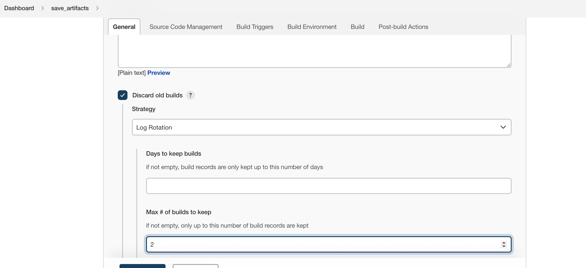

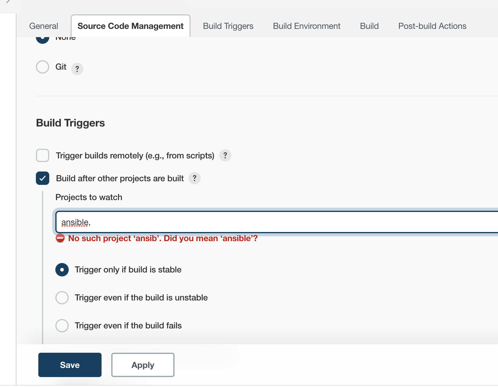

Note: You can configure number of builds to keep in order to save space on the server, for example, you might want to keep only last `2` or 5 build results. You can also make this change to your ansible job. For this project we shall select `2`

6. The main idea of `save_artifacts` project is to save artifacts into `/home/ubuntu/ansible-config-artifact` directory. To achieve this, create a `Build` step and choose `Copy artifacts` from other project, specify `ansible` as a source project and `/home/ubuntu/ansible-config-artifact` as a target directory.

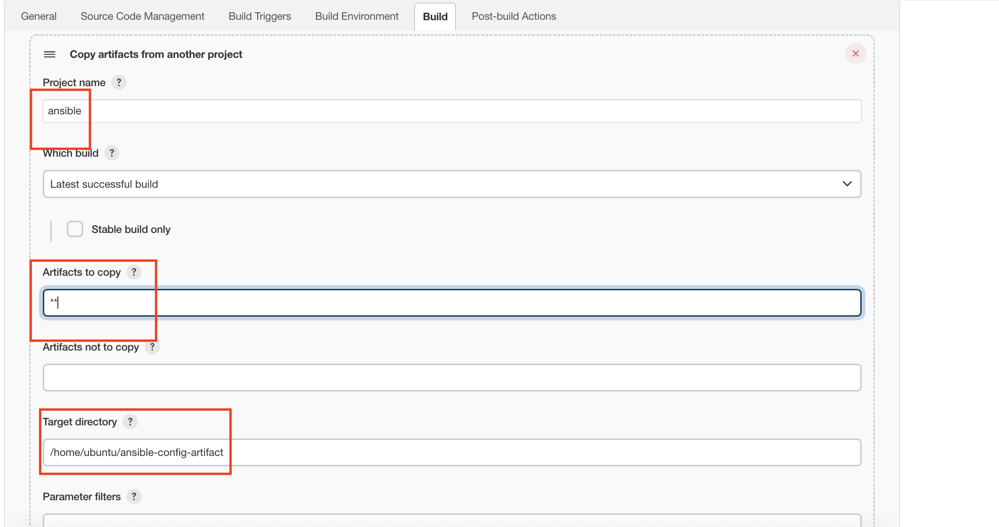

7. Test your set up by making some change in README.MD file inside your `ansible-config-mgt` repository (right inside `master` branch).

If both Jenkins jobs have completed one after another – you shall see your files inside `/home/ubuntu/ansible-config-artifact` directory and it will be updated with every commit to your `master` branch.

Now your Jenkins pipeline is more neat and clean.

###  REFACTOR ANSIBLE CODE BY IMPORTING OTHER PLAYBOOKS INTO SITE.YML

### Step 2 – 

Refactor Ansible code by importing other playbooks into `site.yml`

Before starting to refactor the codes, ensure that you have pulled down the latest code from master (main) branch, and created a new branch, name it `refactor`.

- Ensure you have performed a pull operation whilst in the main branch

- Enter the code `git checkout -b refactor` to create a new branch

DevOps philosophy implies constant iterative improvement for better efficiency – refactoring is one of the techniques that can be used, but you always have an answer to question "why?". Why do we need to change something if it works well?

In `Project 11` you wrote all tasks in a single playbook `common.yml`, now it is pretty simple set of instructions for only 2 types of OS, but imagine you have many more tasks and you need to apply this playbook to other servers with different requirements. In this case, you will have to read through the whole playbook to check if all tasks written there are applicable and is there anything that you need to add for certain server/OS families. Very fast it will become a tedious exercise and your playbook will become messy with many commented parts. Your DevOps colleagues will not appreciate such organization of your codes and it will be difficult for them to use your playbook.

Most Ansible users learn the one-file approach first. However, breaking tasks up into different files is an excellent way to organize complex sets of tasks and reuse them.

Let see code re-use in action by importing other playbooks.

1. Within `playbooks folder`, create a new file and name it `site.yml` – This file will now be considered as an entry point into the entire infrastructure configuration. Other playbooks will be included here as a reference. In other words, site.yml will become a parent to all other playbooks that will be developed. Including `common.yml` that you created previously. Dont worry, you will understand more what this means shortly.

2. Create a new folder in root of the repository and name it `static-assignments`. The static-assignments folder is where all other children playbooks will be stored. This is merely for easy organization of your work. It is not an Ansible specific concept, therefore you can choose how you want to organize your work. You will see why the folder name has a prefix of static very soon. For now, just follow along.

3. Move `common.yml` file into the newly created `static-assignments` folder.

4. Inside `site.yml` file, import `common.yml` playbook.

The code above uses built in `import_playbook` Ansible module.

Your folder structure should look like this;

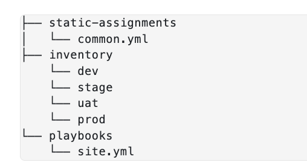

5. Run `ansible-playbook` command against the `dev ` environment

Since you need to apply some tasks to your `dev` servers and `wireshark` is already installed – you can go ahead and create another playbook under `static-assignments` and name it `common-del.yml`. In this playbook, configure deletion of `wireshark utility`.

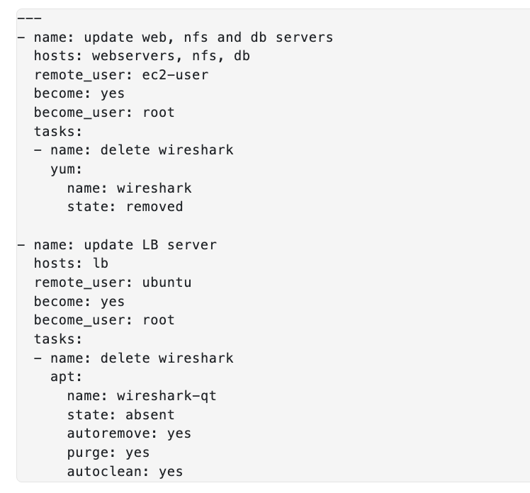

update `site.yml` with - `import_playbook: ../static-assignments/common-del.yml` instead of `common.yml` and run it against `dev` servers:

`cd /home/ubuntu/ansible-config-mgt/`

`ansible-playbook -i inventory/dev.yml playbooks/site.yaml`

- First push all the changes from the `refactor` branch to the `main` branch using:

`git status` `git add . ` `git commit -m "message"` and `git push origin refactor` 

Check that all the codes have been moved to Jenkins and the artifacts have been saved into the `ansible-config-artifacts` folder of the `Jenkins-Ansible` server

NOTE: Before running `import_playbooks` command, you want to ping your hosts from the `ansible-config-artifacts` folder of the `Jenkins-Ansible` server

Note that before you are able to ping servers sucessfully, you need to point the ansible config file to the inventory folder which houses the dev file that has all the hosts. 

- copy the directory path for the inventory folder (ensure you run pwd in the inventory folder)

`/home/ubuntu/ansible-config-artifact/inventory`

- open ansible config file with the following code:

`sudo vi /etc/ansible/ansible.cfg`

now uncomment the `inventory` line and then replace the path with the path you have copied for the inventory folder. Save the modification.

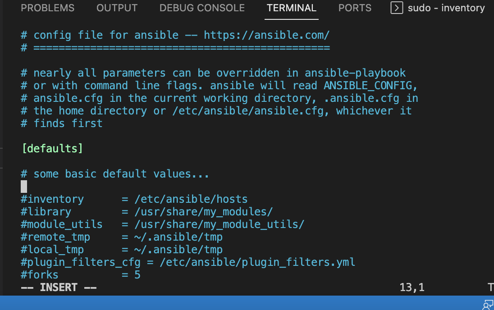

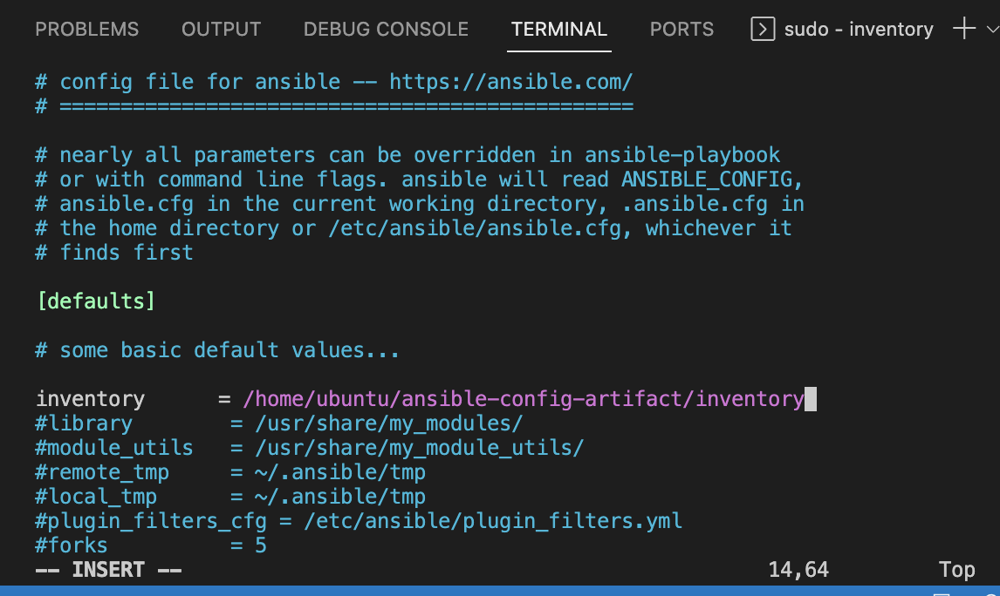

- Now you can ping the hosts by running the code below:

`ansible all -m ping`

The result of the ping is as follows:

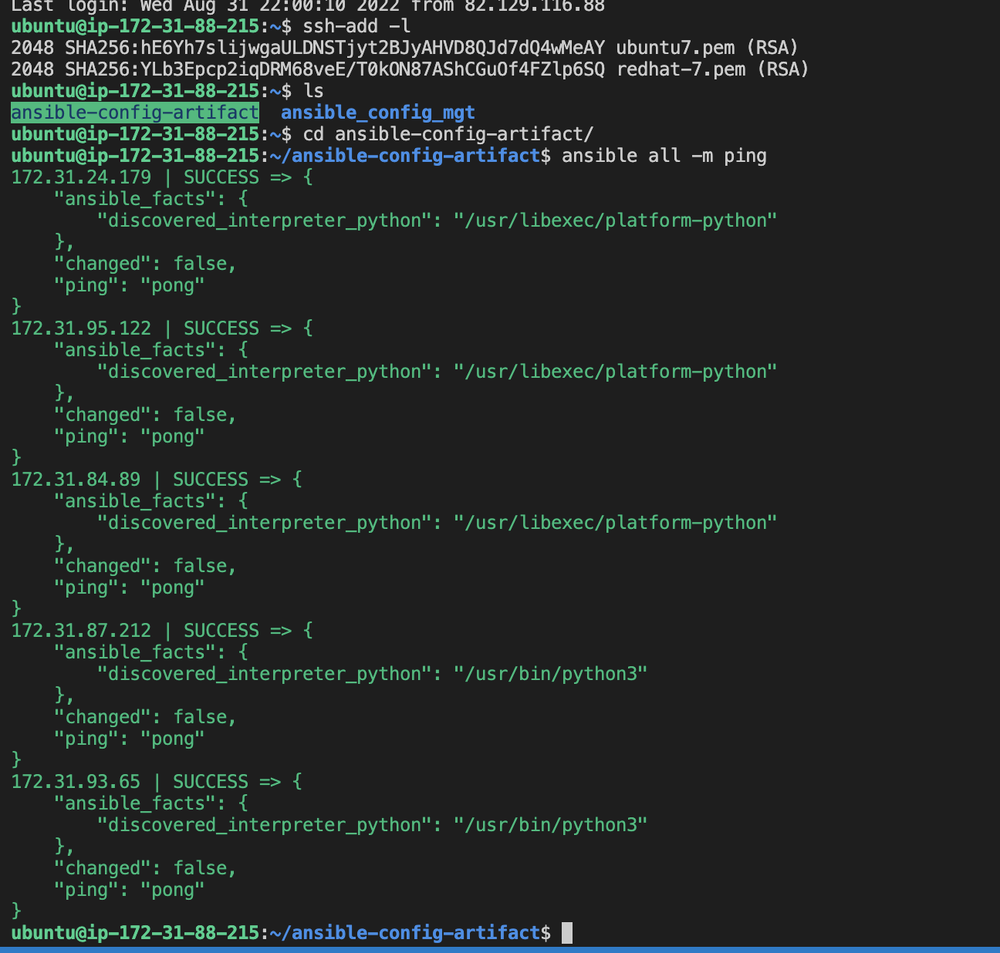

Now you can run the ansible-playbook command to delete wireshark as below:

`ansible-playbook -i /home/ubuntu/ansible-config-artifact/inventory/dev.yml /home/ubuntu/ansible-config-artifact/playbooks/sites.yml `
`ansible-playbook -i inventory/dev.yml playbooks/site.yaml`

Below is the result after running the ansible-playbook command:

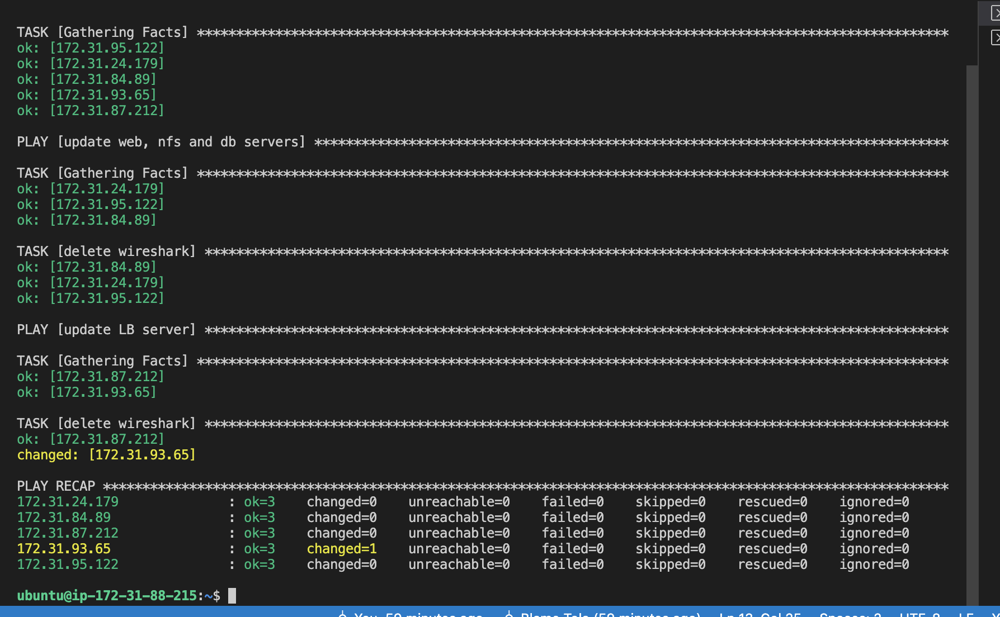

Make sure that `wireshark` is deleted on all the servers by running `wireshark --version`

Below are the results from checking `wireshark --version` on a few of the servers after sshing into them:

Now you have learned how to use `import_playbooks` module and you have a ready solution to install/delete packages on multiple servers with just one command.

## CONFIGURE UAT WEBSERVERS WITH A ROLE ‘WEBSERVER’

## Step 3 – Configure UAT Webservers with a role ‘Webserver’

We have our nice and clean `dev` environment, so let us put it aside and configure 2 new Web Servers as `uat`. We could write tasks to configure Web Servers in the same playbook, but it would be too messy, instead, we will use a dedicated role to make our configuration reusable. (Rolese helps to break out playbooks into chunks that are reusable)

1. Launch 2 fresh EC2 instances using RHEL 8 image, we will use them as our uat servers, so give them names accordingly – `Web1-UAT` and `Web2-UAT`.

Tip: Do not forget to stop EC2 instances that you are not using at the moment to avoid paying extra. For now, you only need 2 new RHEL 8 servers as Web Servers and 1 existing Jenkins-Ansible server up and running.

2. To create a role, you must create a directory called `roles/`, relative to the playbook file or in `/etc/ansible/` directory.

There are two ways how you can create this folder structure:

- Use an Ansible utility called `ansible-galaxy` inside `ansible-config-mgt/roles` directory (you need to create `roles` directory upfront) (Ansible galaxy is a preexisting utility with pre-exisiting roles created. you can then select from these roles. You can only use Ansible galaxy on the `Jenkins-ansible` server. HOwever. I will be created these roles folder in github and then pushing it to Jenkins and later the Jenkins ansible webserver)

        `mkdir roles`
        `cd roles`
        `ansible-galaxy init webserver`

- Create the directory/files structure manually (I will be creating the file sturcutre manually as shown in the structure below. )

Note: You can choose either way, but since you store all your codes in GitHub, it is recommended to create folders and files there rather than locally on Jenkins-Ansible server.

The entire folder structure should look like below, but if you create it manually – you can skip creating `tests`, `files`, and `vars` or remove them if you used `ansible-galaxy`

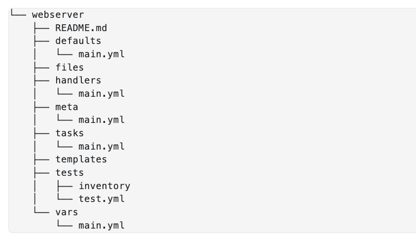

After removing unnecessary directories and files, the `roles` structure should look like this

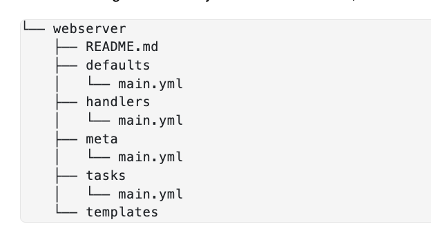

3. Update your inventory `ansible-config-mgt/inventory/uat.yml` file with IP addresses of your 2 UAT Web servers:

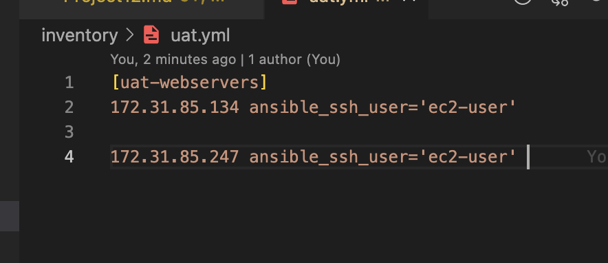

NOTE: Ensure you are using ssh-agent to ssh into the Jenkins-Ansible instance just as you have done in project 11;

4. In `/etc/ansible/ansible.cfg` file uncomment `roles_path` string and provide a full path to your roles directory `roles_path    = /home/ubuntu/ansible-config-mgt/roles`, so Ansible could know where to find configured roles.

enter the code below in the jenkins-ansible server:

` sudo vi /etc/ansible/ansible.cfg`

the changes to roles_path is shown below:

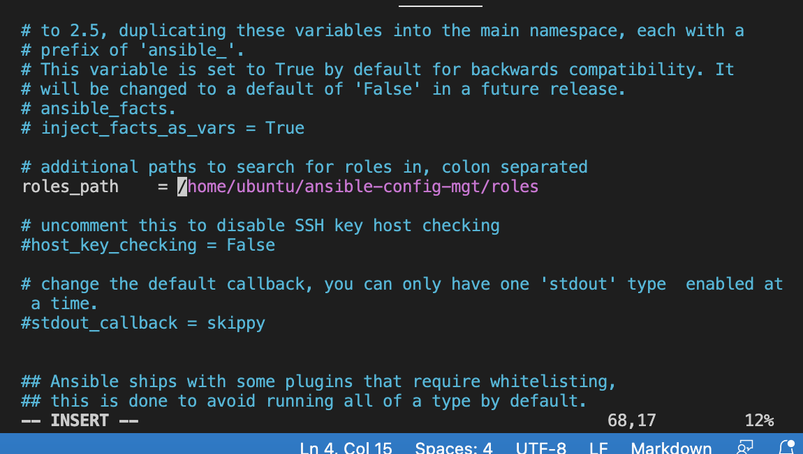

5. It is time to start adding some logic to the webserver role. Go into `tasks` directory, and within the`main.yml` file, start writing configuration tasks to do the following:

- Install and configure Apache (httpd service)
- Clone Tooling website from GitHub https://github.com/<your-name>/tooling.git.(remember to include your username from the tooling github link you previously forked here)
- Ensure the tooling website code is deployed to `/var/www/html` on each of 2 UAT Web servers.
- Make sure httpd service is started

Your `main.yml` may consist of following tasks:

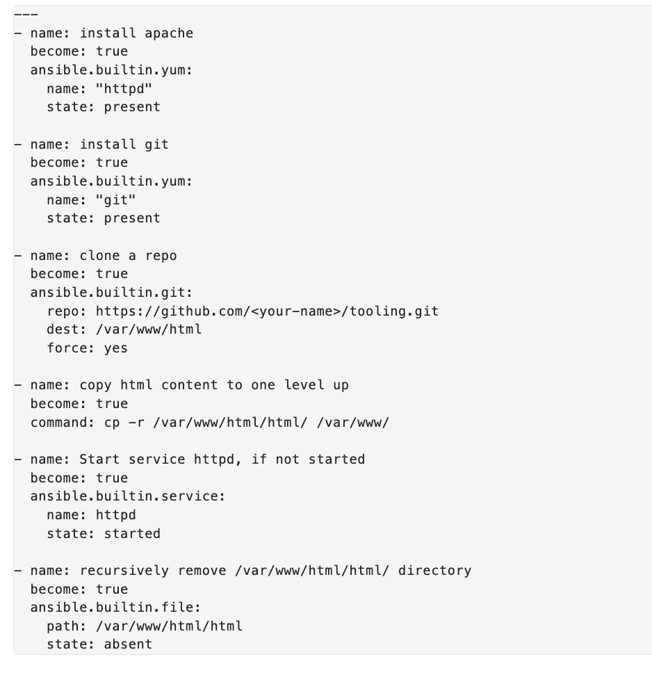

## REFERENCE WEBSERVER ROLE

### Step 4 – Reference ‘Webserver’ role

Within the `static-assignments` folder, create a new assignment for uat-webservers `uat-webservers.yml`. This is where you will reference the role.

The above code means that the hosts is UAT webserves which has the role of a webserver. And as such, ansible will go into the webserver folder and execute whats in the tasks folder

Remember that the entry point to our ansible configuration is the `site.yml file`. Therefore, you need to refer your `uat-webservers.yml` role inside `site.yml`.

So, we should have this in `site.yml`

The above means we have to import the `uat-webservers.yml` file into the `sites.yml` file

### Step 5 – Commit & Test

Commit your changes, create a Pull Request and merge them to `master` branch, make sure webhook triggered two consequent Jenkins jobs, they ran successfully and copied all the files to your `Jenkins-Ansible` server into `/home/ubuntu/ansible-config-mgt/` directory.

Now run the playbook against your `uat` inventory and see what happens with the code:

`ansible-playbook -i /home/ubuntu/ansible-config-artifact/inventory/uat.yml /home/ubuntu/ansible-config-artifact/playbooks/sites.yml`

Below is a snapshot of the sucessful code

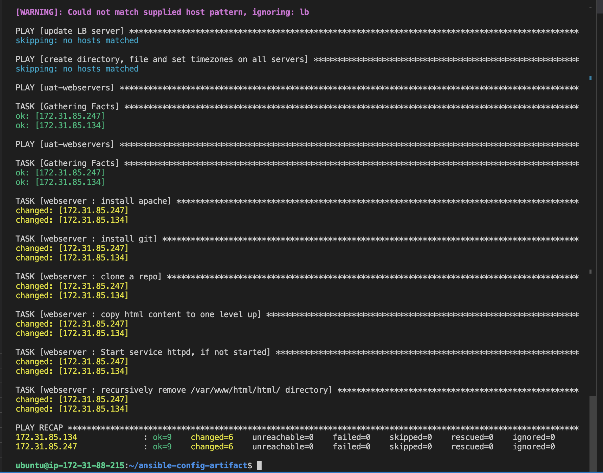

You should be able to see both of your UAT Web servers configured and you can try to reach them from your browser:

`http://<Web1-UAT-Server-Public-IP-or-Public-DNS-Name>/index.php`

or

`http://<Web1-UAT-Server-Public-IP-or-Public-DNS-Name>/index.php`

Below is a snapshot from putting the public address of the webservers into the browser

Your Ansible architecture now looks like this:

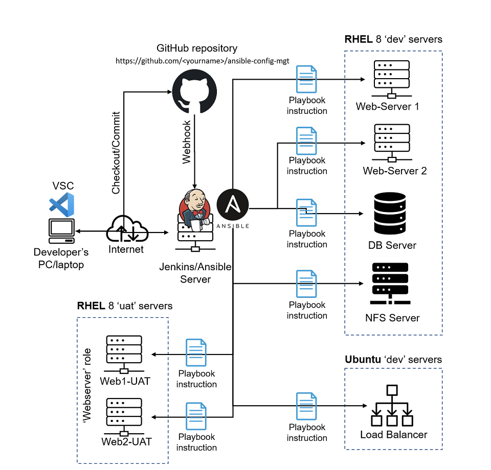

In Project 13, you will see the difference between Static and Dynamic assignments.

